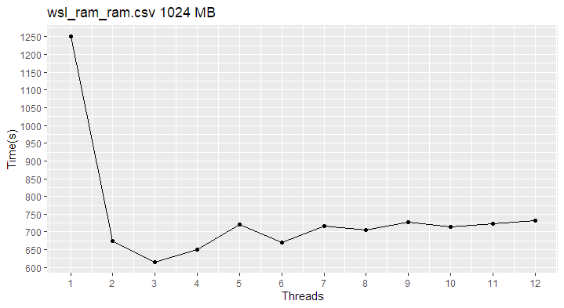

# Decisões de Projeto
## Algoritmo de Ordenação
Foram testados múltiplos algoritmos de ordenação e estratégias de paralelização diferentes. Para a escolha do melhor, foram executadas benchmarks pequenas ram-ram. Os algoritmos testados foram, em sequência:

1. **Merge Sort** seguido de **Merge Sort;**
2. **Radix Sort** seguido de **Merge Sort;**
3. **Radix Sort** com **contagem síncrona;**
4. **Radix Sort** com **contagem paralela.**

Esse último sendo o algoritmo presente na implementação final. Ele apresenta o maior grau possível de paralelização e performance absoluta, levando em conta o overhead de sincronização entre as threads.

## Elemento de Ordenação
Decidiu-se utilizar **chaves de ordenação** ao invés de ordenar registros completos. Os registros são **100 bytes** em tamanho. Movimentar 100 bytes múltiplas vezes acaba sendo custoso não só pelo tamanho em si, mas pelo fato de que, para cada registro, acontece pelo menos um acesso a memória desalinhado, pois 100 bytes não é múltiplo de **8**.

O uso de chaves de ordenação permite que o algoritmo se preocupe apenas com a ordenação das chaves e de um ponteiro extra, que ao final do algoritmo, permitirá a transformação das chaves de volta nos registros originais.

## Alocação
O algoritmo inteiro executa apenas **uma singular alocação** assim que toma conhecimento do número de threads necessárias e o tamanho do arquivo de entrada. Cada alocação muito possivelmente envolve uma chamada de sistema, além de não garantir a proximidade das regiões de memória alocadas, o que potencialmente prejudicaria o desempenho da memória cache ligeiramente.

Além disso, não há necessidade de alocações parciais e liberamento de memória em frações. A quantidade de memória necessária é imediatamente conhecida logo no começo do algoritmo. O alocador customizado realiza apenas uma alocação, de acordo com as múltiplas chamadas _mm_alloc()_ executadas.

## Cópias
Não é feita **nenhuma cópia de dados** que não seja estritamente necessária. As etapas do algoritmo realizam movimentações entre buffers A e B de forma alternada, complicando ligeiramente o teste do algoritmo, mas eliminando completamente as cópias desnecessárias.

## Barreiras
Para sincronizar as várias threads auxiliares entre as etapas do algoritmo, foram implementadas **barreiras** e o que nomeei de **barreiras lentas**. As barreiras funcionam do jeito que se espera: aguardam a chegada de todas as threads sendo que a última pode passar direito, simultaneamente liberando a barreira para as outras threads passarem. 

A **barreira lenta** deixa a última thread passar direto, mas não levanta a barreira automaticamente. A barreira precisa ser levantada manualmente por essa thread singular. O resultado desse mecanismo é um ponto de sincronização que permite que apenas uma thread realize algum trabalho antes de deixar as outras threads prosseguirem.

No algoritmo, a barreira lenta foi utilizada para gerar o vetor de prefixos globais de maneira síncrona. Essa tarefa quando paralelizada não ofereceu benefício tangível.

## Funcionamento do Algoritmo
1. O programa decide o número de threads a utilizar. Se nenhum número for explicitamente pedido, o programa utiliza **80%** do número de threads disponíveis na máquina, seguindo uma heurística observada no comportamento dos benchmarks.
2. O programa abre os arquivos de entrada e de saída utilizando a chamada de sistema mmap().
3. Uma única alocação dinâmica é realizada para guardar todo o estado do programa.
4. **t** Threads são invocadas, cada uma com um offset no vetor de registros (e vetores auxiliares) que essa thread será responsável por cuidar.
5. A thread principal aguarda o retorno das auxiliares para terminar a execução do programa.

A partir de agora, **cada thread** faz o seguinte:
1. Transforma a sua região de registros em chaves de ordenação.
2. Executa uma passada do **Radix Sort** na região de chaves, onde:
	
	a. Uma contagem dos dígitos é feita num vetor de contagem.

	b. Os vetores de contagens das threads são transformados em um vetor de prefixos global paralelamente.

	c. Utilizando o vetor de prefixos global, as chaves de ordenação são coalescidas em suas posições ordenadas.

3. É feita uma segunda passada do radix, igual a primeira.
4. A região de chaves ordenadas é convertida para registros diretamente na região de saída do algoritmo.

## Outros Testes Realizados
**a)** O uso de chaves **32-bit** ou **64-bits** não demonstrou nenhuma diferença significativa em nenhum dos testes, mesmo que elementos Key* de **12 bytes** causem desalinhamento, o estilo de movimentação do algoritmo e a ausência de cópias de grandes blocos causam essa indiferença.

**b)** A última passada do radix poderia coalescer as chaves diretamente no vetor de saída, mas houve perda severa de performance quando essa ideia foi implementada. Muito possivelmente dado a pior localidade de acesso na memória.

**c)** Para garantir o máximo de performance, as barreiras foram testadas utilizando _busy waiting_ ao invés dos mecanismos de sincronização nativos. Não houve diferença em performance, possivelmente em decorrência das massivas otimizações que a biblioteca pthreads já possui. Teoricamente, pthreads já utiliza um esquema de **backoff exponencial**, que começa com _busy waiting_, mas põe a thread para dormir se o mutex demorar muito para ser liberado.

# Plataforma de Testes
Para obter a maior acurácia possível nos testes de desempenho, o sistema foi deixado/configurado de acordo com as seguintes especificações, visando o sistema mais “quieto” e estável possível:

* Conectado na tomada e no modo de energia de máximo desempenho.
* Fresco após uma reinicialização.
* Nenhuma outra aplicação aberta além do script de testes.
* Desconectado da rede.
* Coolers configurados ao máximo manualmente.

###	Especificações do Sistema

**SO**: **Lubuntu 24.10**.

**Modelo**: Notebook Dell G15 5510.

**RAM**: 8 GB DDR4 (Single-Channel).

**CPU**: Intel Core i5-11400H - 6 Cores, 12 Threads. - 2.7GHz

**Disco**: SSD BC711 NVMe SK Hynix 512GB

### Metodologia

Para executar os testes, foi utilizado um script em Python em conjunto com a ferramenta de linha de comando hyperfine, que permite executar múltiplas vezes o mesmo comando para testar o tempo de execução.

O número de testes escolhidos foi **8** (o máximo possível que levasse um dia para executar com todos os parâmetros de threads e tamanhos de arquivos). Foi escolhido **5** como o número de testes de aquecimento, os tempos de execução desses testes são descartados pelo programa automaticamente.

# Desempenho (Ram-Ram)
A performance do algoritmo exibe um padrão razoavelmente claro de acordo com o tamanho do arquivo e o número de threads. Mais de 4 threads raramente ajudam. Isso evidencia muito bem um gargalo nos barramentos tanto de memória, quanto possivelmente internos da CPU. O poder de processamento da CPU não consegue ser melhor utilizado.

**Comando utilizado:**

**Tabela com os principais tamanhos, número de threads e intervalos de confiança (CI):**

**Errata: para os gráficos abaixo, a unidade de medida do eixo Y é ms (milisegundos), não s (segundos).**

# Desempenho (Disco-Disco)

A performance do algoritmo de ordenação mostrou-se muito imprevisível quando operando no disco. Mesmo fazendo a limpeza do cache e aguardando a conclusão da limpeza do cache, o tempo de execução continuou sem significância estatística alguma, exibindo tempos de execução sem coesão.
	
Dada a diferença grande desses tempos de execução vs. os tempos quando utilizando ordenação ram-ram, fica claro que o disco é o gargalo do tempo de execução e a causa da imprevisibilidade do algoritmo.

Experimentos realizados para diminuir a imprevisibilidade (todos sem sucesso em diferentes níveis):
* Limpar o cache do kernel.
* Adicionar um tempo de espera.
* Aumentar o número de rodadas de aquecimento (warm ups).
* Aumentar o número de rodadas verdadeiras (runs).
* Descartar testes aberrantes e executá-los de novo: Sem sucesso, pois, entre benchmarks diferentes, usar mais threads por vezes ajudava e por vezes piorava o desempenho, mesmo com médias estáveis e desvios padrão baixos nos dois casos.

**Comando utilizado no final:**

# Conclusão
Buscar a máxima performance do algoritmo foi um experimento muito proveitoso. Encontrar no código operações redundantes e oportunidades de otimização foi muito difícil, ao mesmo tempo que satisfatório, cada milisegundo a menos no tempo de execução motivou a caça pelo próximo.

Dito isso, a performance verdadeira desse algoritmo frente aos outros algoritmos é deixada nas mãos da magia da computação, pois o desempenho da ordenação em disco continua sendo um mistério para o pesquisador. Além disso, o número certo de threads a ser utilizado permaneceu uma questão não respondida.

A presença ou não de hyper-threading no processador, e quantas threads cada núcleo possui com certeza impacta na performance do algoritmo. As threads muito possivelmente competem pelos recursos do núcleo e causam mais overhead do que ganho em desempenho. Mesmo assim, o melhor número de threads só pode ser descoberto conhecendo a topologia exata do processador e através de muitos e muitos testes em máquinas diferentes. 

Talvez no futuro esse experimento seja expandido, e esses comportamentos sejam melhor entendidos.
